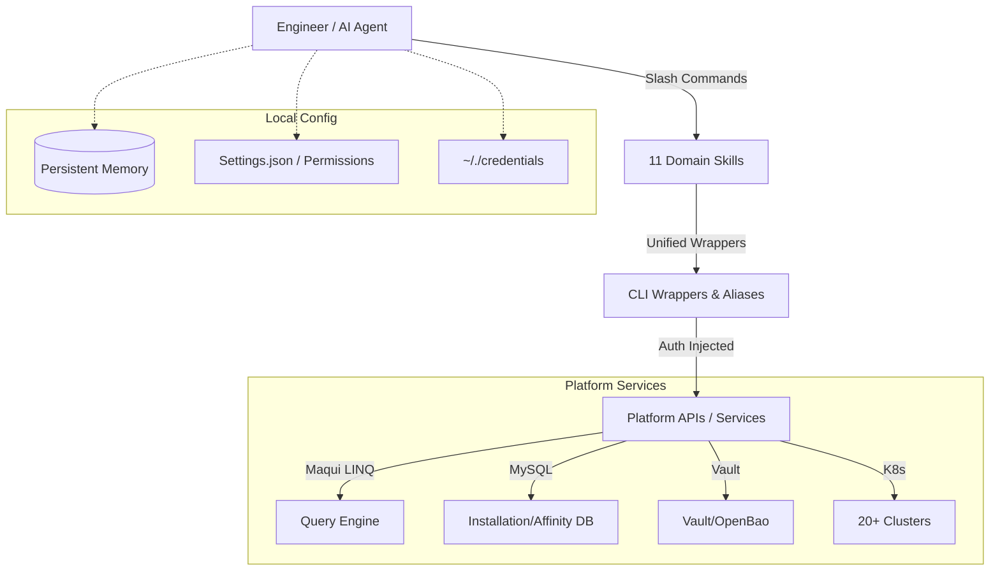
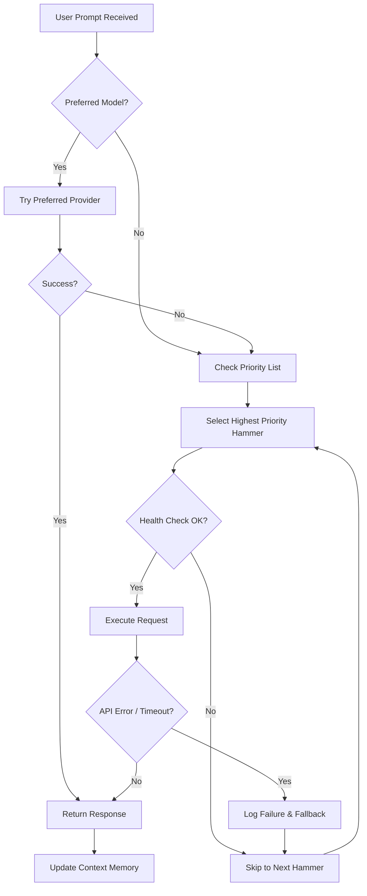
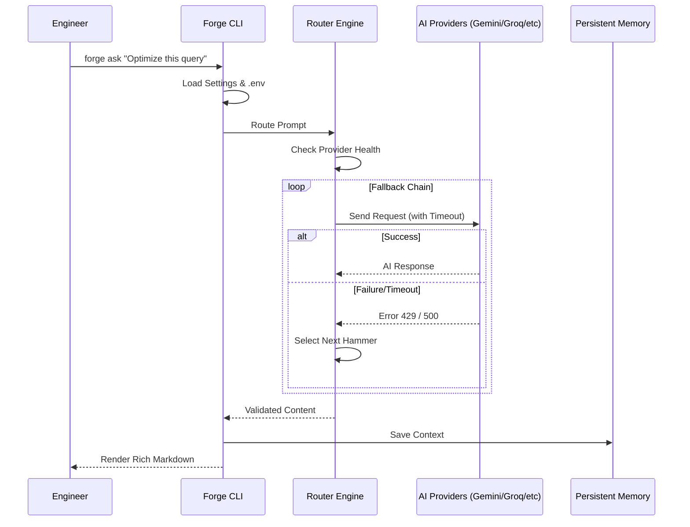

# Why Your Engineering Team Needs an AI Router (and How We Built One)

In the rapidly evolving landscape of Large Language Models (LLMs), the "single-provider" strategy is becoming a liability. Whether it's a rate limit on Claude, a service outage on OpenAI, or the sheer cost of running GPT-4 for simple tasks, relying on one AI hammer is risky.

Today, I’m excited to introduce **Forge**, a high-performance, multi-LLM routing engine designed to bring resilience and intelligence to your AI operations.

## The Problem: The Single-Point-of-AI-Failure

As platform engineers, we’ve all been there:
1. **The Rate Limit Wall:** You're in the middle of a complex refactor, and suddenly: `429: Too Many Requests`.
2. **The Outage Blues:** OpenAI is down, and your entire automated CI/CD feedback loop grinds to a halt.
3. **The Complexity Mismatch:** Using a $0.03/1k token model for a simple regex explanation is like using a sledgehammer to hang a picture frame.

## The Solution: The "Forge" Architecture

We built Forge with a "Crescent" architecture—an operational layer that wraps around the engineer's local environment and cloud services. It doesn't just call an API; it orchestrates a fallback chain of "AI Hammers."

### 🏗️ High-Level Ecosystem (Crescent Architecture)

The "Crescent" design ensures that AI Forge acts as a protective and empowering layer around the developer, bridging local tools with global infrastructure.

### 🧠 Intelligent Routing & Fallback Logic

How does Forge decide which "Hammer" to use? It follows a sophisticated fallback tree that prioritizes speed, cost, and availability.

### ⏱️ Request Lifecycle (Sequence Diagram)

Behind every `forge ask` command is a multi-step orchestration process that ensures security and resilience.

### How It Works:
* **Dynamic Routing:** Forge maintains a priority-based list of providers (Gemini, Groq, Claude, OpenAI, Ollama).
* **Instant Fallback:** If the top-priority provider fails, Forge catches the exception and immediately tries the next one. The user only sees a slight delay, never a failure.
* **Local-First with Ollama:** For privacy-sensitive or low-complexity tasks, Forge can route requests to local Llama 3 instances via Ollama, saving costs and ensuring data stays on-prem.

## A Professional Terminal Experience

We didn't just want an API wrapper; we wanted a tool that felt at home in a Senior Engineer's toolkit. Leveraging Python's `rich` and `prompt-toolkit` libraries, we built an interactive CLI that features:
* **Syntax Highlighting:** Full markdown support for code blocks.
* **Multiline Input:** Handle complex prompts with ease.
* **Diagnostic Reporting:** A `forge doctor` command that verifies everything from API keys to local tool paths.

## Why Python?

While we initially explored Node.js, we shifted to Python for the `forge-router` to leverage the deep ecosystem of AI and Data Science libraries. Python’s `asyncio` allows us to handle multiple API calls concurrently, and `pydantic-settings` provides robust, type-safe environment management.

## Lessons Learned

1. **Provider Diversity is Resilience:** Mixing cloud providers (Google, Anthropic, OpenAI) with hardware-accelerated inference (Groq) and local models (Ollama) creates a robust system that is nearly impossible to take down.
2. **Aesthetics Matter:** In a CLI-driven world, clear progress indicators and beautifully formatted output reduce cognitive load and make AI a pleasure to use.
3. **Security by Design:** Centralizing credentials in a single, encrypted `.env` or vault-backed file ensures that developers don't accidentally commit secrets.

## Join the Forge

Forge is more than just a tool; it’s a mindset shift. It’s about moving from "using an AI" to "orchestrating an AI ecosystem." 

If you’re interested in building more resilient AI integrations, check out the project and let’s start forging the future together.

---
**Vikash Jaiswal**  
Lead Platform Engineer | AI Systems Architect  
*Passionate about building the tools that build the future.*
