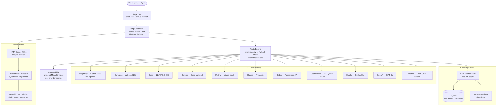
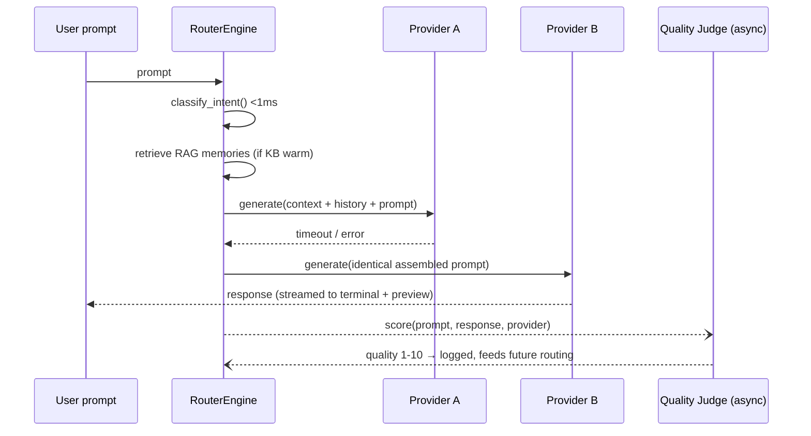
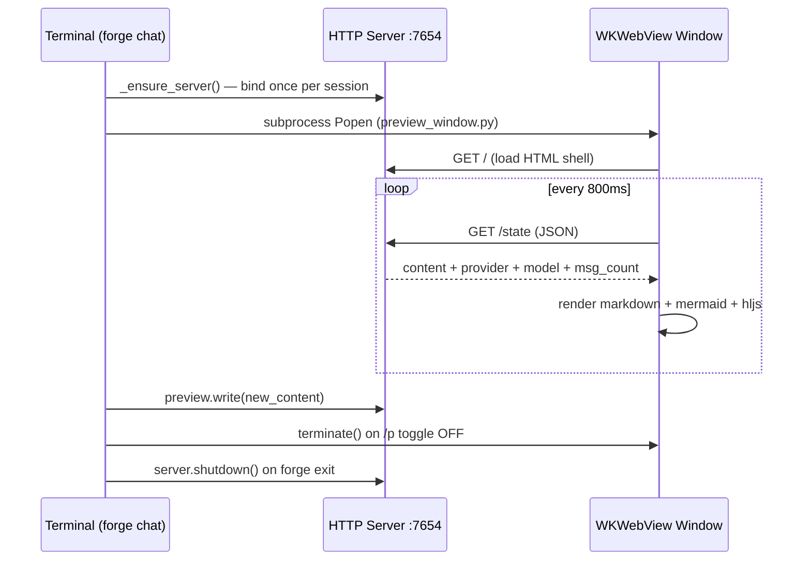
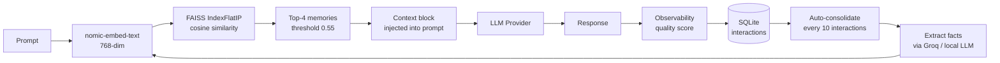

# ⚒ Forge Router — Multi-LLM Orchestration Engine

A terminal-first AI assistant that routes prompts across **11 LLM providers** with intent-based fallback chains, renders responses in a native macOS preview window, and maintains persistent conversation memory with RAG retrieval.

**v0.2.0** — last CLI-only release. Next: evolution into an enterprise AI gateway — see [`docs/ENTERPRISE-GATEWAY-EVALUATION.md`](docs/ENTERPRISE-GATEWAY-EVALUATION.md).

---

## Architecture



---

## Intent Routing

Prompts are classified in under 1ms (regex), then routed through the optimal provider chain. Any provider exceeding the **60s wall-clock cap** is cancelled and the router moves on.

| Intent | Timeout | Provider Order |
|---|---|---|
| `chat` | 15s | groq → cerebras → antigravity → claude → mistral → openai → hermes → openrouter → ollama |
| `summarization` | 20s | antigravity → groq → cerebras → claude → mistral → openrouter → openai → ollama |
| `code` | 30s | codex → claude → hermes → openrouter → mistral → openai → groq → cerebras → ollama |
| `reasoning` | 45s | hermes → claude → openrouter → mistral → openai → groq → cerebras → antigravity → ollama |
| `agentic` | 60s | claude → openai → hermes → openrouter → groq → cerebras → mistral → antigravity → ollama |

Unhealthy providers are skipped automatically. Conversation history, loaded file/repo context, and RAG memories all transfer intact across fallbacks — every provider in the chain receives the identical assembled prompt.



---

## Local-File Bridge

Cloud LLMs can't touch your filesystem — forge bridges that. Mention any real file or directory path in a prompt and forge reads it locally, injects the contents into the provider call, and the LLM answers as if it read the file itself:

```
Forge ❯ Can you review /Users/vikash/Documents/Projects/saturs/app.py?
◈ Auto-loaded /Users/vikash/Documents/Projects/saturs/app.py — 4,213 chars
  forge read it locally — the LLM now sees its contents in every call.
```

Works with files and whole directories (loaded as a repo tree), skips binaries, caps at 120KB/file, and stays loaded for the whole session across provider failovers. Explicit `/file` and `/repo` commands still work for fine control.

## Agentic File Operations

The core workflow: load a repo, ask any LLM to write/fix code, save it, run it, iterate — without leaving forge.

```
/repo /path/to/project      # inject entire repo into every LLM call
"Write a FastAPI endpoint"
/write src/api/users.py     # saves largest code block → auto-loads back into context
/run python src/api/users.py  # output injected into conversation history
"Fix the error above"       # next LLM (even after failover) sees the error
```

---

## Preview Window



**Toggle:** `/p`, `/preview`, or `Ctrl+P`
**Auto-open:** fires automatically when a response contains mermaid diagrams, images, or media
**Restore on open:** last response shown immediately — no blank window

---

## Knowledge Base (RAG)



**Cold-start safe:** retrieval is skipped when the index is empty — no embed cost on first run.

---

## Installation

```bash
git clone https://github.com/vikas0486/forge-router.git
cd forge-router

# pipx (recommended — global `forge` command)
pipx install .

# or with uv
uv sync && uv pip install -e .
```

### Credentials — single source of truth

All API keys load from **`/Users/vikash/Documents/Projects/credentials/.env`** (falling back to a local `.env`). Parsed by `forge_core/config/settings.py` — keys are read once at startup and never logged or committed. How each of the 11 providers authenticates:

| Provider | Credential | Source |
|---|---|---|
| `groq`, `hermes` + quality judge | `GROQ_API_KEY` (or `GROQ_API_KEY_2`) | credentials/.env |
| `cerebras` | `CEREBRAS_API_KEY` | credentials/.env (cloud.cerebras.ai free tier) |
| `mistral` | `MISTRAL_API_KEY` | credentials/.env (console.mistral.ai free tier) |
| `claude` | `ANTHROPIC_API_KEY` (or `CLAUDE_API_KEY`) | credentials/.env |
| `openai` | `OPENAI_API_KEY` | credentials/.env |
| `codex` | `CODEX_API_KEY` (falls back to `OPENAI_API_KEY`) | credentials/.env |
| `openrouter` | `OPENROUTER_API_KEY` | credentials/.env |
| `copilot` | GitHub Copilot CLI login (`GITHUB_TOKEN`) | copilot CLI OAuth + credentials/.env |
| `antigravity` | none — `agy` CLI uses local OAuth | no key needed |
| `ollama` | none — local inference | no key needed |

Verify everything with `forge doctor`.

### Runtime data — single home at `~/.forge/`

```
~/.forge/
├── kb/               # FAISS + SQLite knowledge base (RAG memory)
├── repo-memory/      # /repo session summaries for cross-session recall
├── logs/             # observability.jsonl — quality judge scores
├── results.md        # last preview content
└── preview_state.json
```

Nothing is written into the repo or your CWD at runtime.

---

## Usage

```bash
forge                 # interactive chat (default)
forge chat --model groq
forge chat --preview  # open preview window immediately
forge ask "Explain Qdrant vs FAISS for hybrid search"
forge status          # provider health (all 11)
forge doctor          # diagnose keys + tools + health
```

### In-chat commands

| Command | Action |
|---|---|
| `/file <path>` | Load a file into session context |
| `/repo <path>` | Load an entire repo into session context |
| `/context` | Show loaded files — `/context clear` to reset |
| `/write <path>` | Save last response (or largest code block) to file |
| `/run <command>` | Run shell command, inject output as context |
| `/p` `/preview` `Ctrl+P` | Toggle WKWebView preview window |
| `/model <name\|auto>` | Lock to a provider / resume auto-routing |
| `/image <path>` | Attach image for Vision |
| `/stats` `/kb` | Session stats + memory KB info |
| `/status` `/models` | Provider health check |
| `/clear` `/history` `/help` | Housekeeping |
| `exit` / `quit` / `bye` / `q` | Exit |

---

## Project Structure

Since v0.3.0 the engine lives in **`forge_core`** — an embeddable package with zero CLI/UI imports (enforced by test), so the CLI today and the HTTP gateway in Phase 1 drive the identical engine:

```
forge_core/                 # ── the embeddable engine (gateway-ready) ──
├── router/
│   ├── engine.py           # RouterEngine, RoutingContext, intent chains
│   └── observability.py    # Async LLM quality judge
├── providers/              # 11 provider adapters (all extend BaseProvider)
├── memory/
│   ├── knowledge_base.py   # FAISS + SQLite KB, auto-consolidation
│   └── embedder.py         # Ollama nomic-embed-text wrapper
└── config/
    └── settings.py         # pydantic-settings, credential loading

forge/                      # ── the CLI client ──
├── cli.py                  # Typer entry point
├── chat.py                 # ForgeChat REPL — context, preview, /write /run,
│                           #   local-file bridge (auto-loads paths in prompts)
└── ui/
    ├── console.py          # Rich terminal output
    ├── preview_server.py   # HTTP server + ForgePreview singleton
    └── preview_window.py   # pywebview WKWebView subprocess
```

---

## Roadmap — Enterprise AI Gateway

Forge is evolving from a CLI router into a data-plane/control-plane AI gateway (virtual keys, OpenAI/Anthropic-compatible endpoints, cost metering, governance) while keeping this chat experience as its first client.

| Phase | Deliverable |
|---|---|
| 0 — Extraction | `forge-core` package (router + providers, zero CLI imports) |
| 1 — Gateway MVP | FastAPI `/v1/chat/completions` + `/v1/messages`, virtual keys, cost metering |
| 2 — Governance | Teams, RBAC, budgets, dashboards, audit log |
| 3 — Intelligence | Guardrails, semantic cache, judge-informed routing, MCP registry |
| 4 — Enterprise | SSO/SCIM, Helm/HA, compliance tooling |

Full architecture: [`docs/ENTERPRISE-GATEWAY-EVALUATION.md`](docs/ENTERPRISE-GATEWAY-EVALUATION.md)

---

**Author:** Vikash Jaiswal · vikashjaiswal.486@gmail.com — *Automating the future of AI Operations.*
