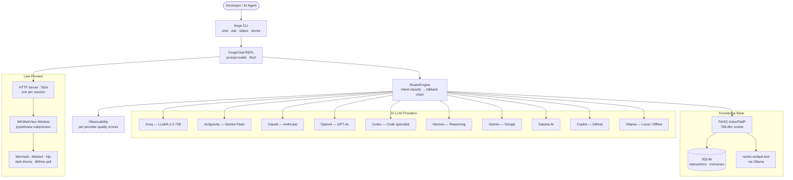
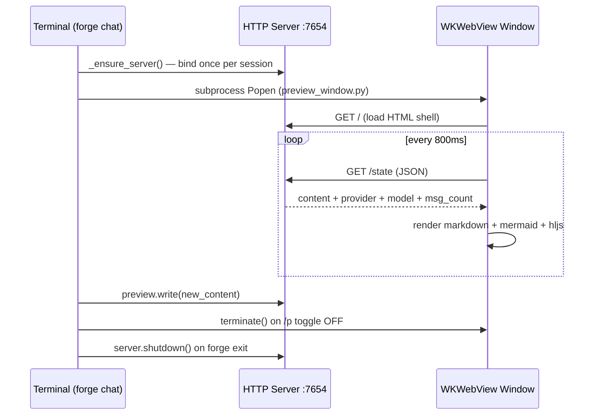
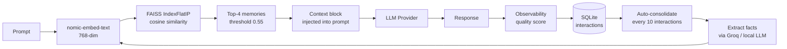

# ⚒ Forge Router — Multi-LLM Orchestration Engine

A terminal-first AI assistant that routes prompts across **10 LLM providers**, renders responses in a native macOS preview window, and maintains persistent conversation memory with RAG retrieval.

---

## Architecture



---

## Intent Routing

Prompts are classified in under 1ms (regex), then routed to the optimal provider chain:

| Intent | Timeout | Provider Order |
|---|---|---|
| `chat` | 15s | Groq → Antigravity → Claude → OpenAI → Hermes → Ollama |
| `summarization` | 20s | Antigravity → Groq → Claude → OpenAI → Ollama |
| `code` | 30s | Codex → Claude → Hermes → OpenAI → Groq → Ollama |
| `reasoning` | 45s | Hermes → Claude → OpenAI → Groq → Sakana → Antigravity → Ollama |
| `agentic` | 60s | Claude → OpenAI → Hermes → Groq → Antigravity → Ollama |

Unhealthy providers are skipped automatically. Context (conversation history) transfers intact across fallbacks.

---

## Preview Window



**Toggle:** `/p`, `/preview`, or `Ctrl+P`
**Auto-open:** fires automatically when response contains mermaid diagrams, images, or media
**Restore on open:** last response shown immediately — no blank window

---

## Knowledge Base (RAG)



**Cold-start safe:** retrieval skipped when index is empty — no embed cost on first run.

---

## Installation

> 🪟 **On Windows?** Follow the **[Windows Runbook](runbook_4_Windows.md)** instead — it
> covers the venv setup, the required UTF-8 console fix, and Windows-specific gotchas
> step by step. Copy `.env.example` → `.env` and add your keys.

```bash
# Clone
git clone https://github.com/vikash/forge-router.git
cd forge-router

# Install (pipx recommended — gives a global forge command)
pipx install .

# Or with uv
uv sync && uv pip install -e .
```

Configure credentials in `~/.devo/credentials` or `.env` (copy `.env.example` to start):

```env
ANTIGRAVITY_API_KEY=...
GEMINI_API_KEY=...
GROQ_API_KEY=...
ANTHROPIC_API_KEY=...
OPENAI_API_KEY=...
GITHUB_TOKEN=...
```

---

## Usage

```bash
# Interactive chat (recommended)
forge chat

# Force a provider
forge chat --model groq

# Open preview window immediately
forge chat --preview

# One-shot question
forge ask "Explain Qdrant vs FAISS for hybrid search"

# Provider health
forge status

# Diagnose env / keys / tools
forge doctor
```

### In-chat commands

| Command | Action |
|---|---|
| `/p` or `/preview` | Toggle WKWebView preview window |
| `Ctrl+P` | Same — keyboard shortcut |
| `/model <name>` | Lock to a provider |
| `/model auto` | Release lock, resume routing |
| `/image <path>` | Attach image for Vision |
| `/stats` `/kb` | Session stats + memory KB info |
| `/status` | Provider health check |
| `/clear` | Reset screen + conversation context |
| `/history` | Recent prompt history |
| `/help` | All commands |
| `exit` / `quit` / `bye` | Exit |

---

## Project Structure

```
forge/
├── cli.py                  # Typer entry point
├── chat.py                 # ForgeChat REPL — preview lifecycle, key bindings, history
├── router/
│   ├── engine.py           # RouterEngine, RoutingContext, intent classification
│   └── observability.py    # Quality scoring per provider
├── providers/              # 10 provider adapters (all extend BaseProvider)
├── memory/
│   ├── knowledge_base.py   # FAISS + SQLite KB, auto-consolidation
│   └── embedder.py         # Ollama nomic-embed-text wrapper
├── ui/
│   ├── console.py          # Rich terminal output
│   ├── preview_server.py   # HTTP server + ForgePreview singleton
│   └── preview_window.py   # pywebview WKWebView subprocess
└── config/
    └── settings.py         # pydantic-settings, credential loading
```

---

## Roadmap — AI Gateway Governance

| Phase | Timeline | Deliverable |
|---|---|---|
| 0 — Foundation | Jun 28 – Jul 4 | DORA KPI baseline, observability hooks |
| 1 — Gateway Core | Jul 5 – Jul 18 | Rate limiter, circuit breaker, token budget, prompt injection detector |
| 2 — Qdrant + Privacy | Jul 19 – Aug 8 | Offline Qdrant (Docker), PII classifier, data sovereignty routing |
| 3 — Semantic Cache | Aug 9 – Aug 22 | ChromaDB embedded prototype, cache layer |
| 4 — Multi-Agent | Aug 23 – Sep 5 | Agent competition, QoS tiers |
| 5 — GPU Backends | Sep 6 – Sep 19 | High-performance inference server integration |

Full governance design: `AI_GATEWAY_GOVERNANCE.md` in the AI-Forge repo.

---

**Author:** Vikash Jaiswal — *Automating the future of AI Operations.*
