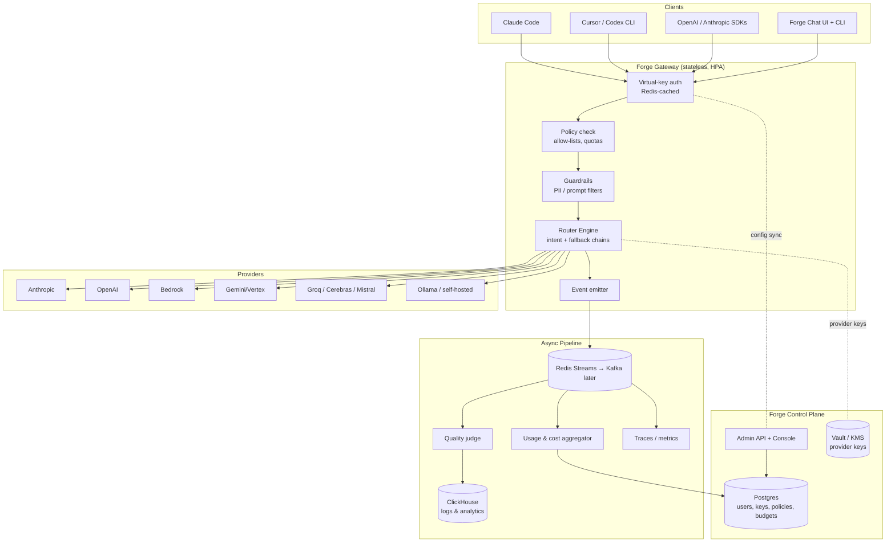
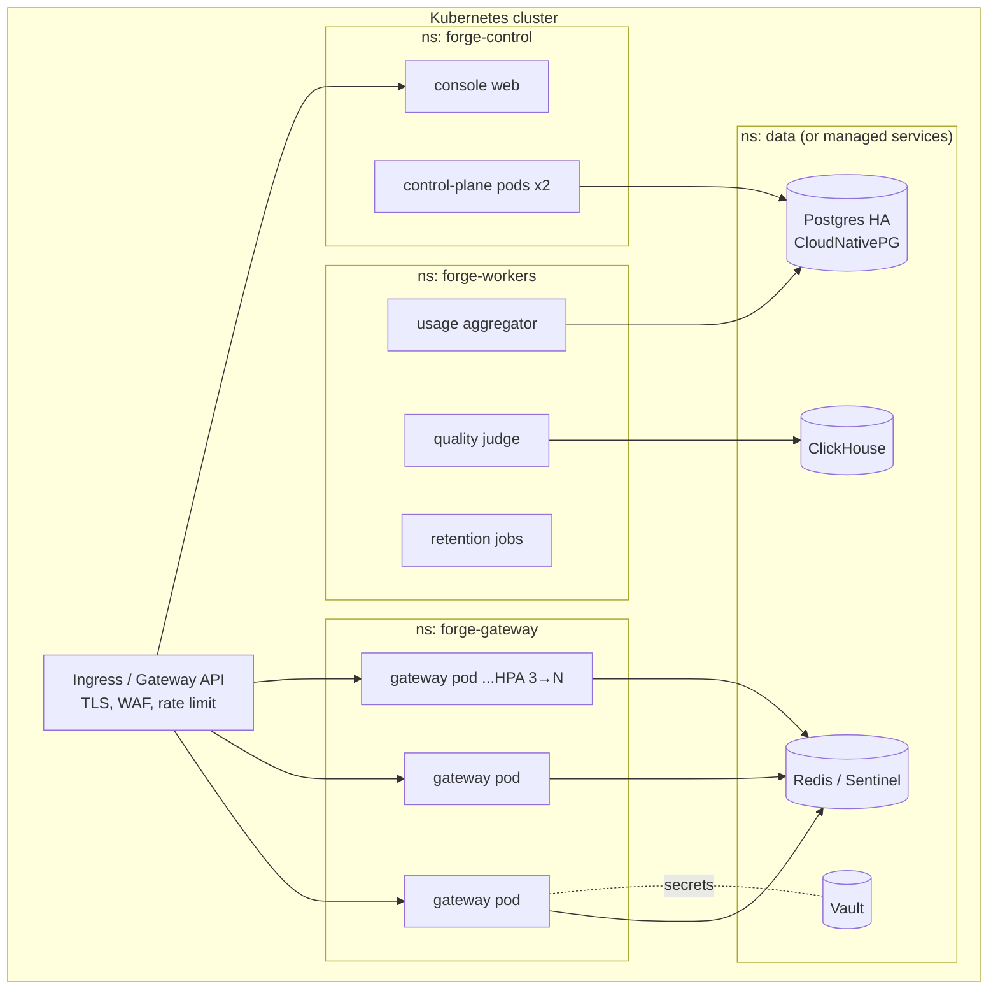

# Forge Enterprise AI Gateway — Feasibility & Architecture Evaluation

**Author:** Principal Platform Architecture review, July 2026
**Scope:** Can Forge Router evolve from a terminal-first multi-LLM router into an
enterprise AI gateway (Bifrost-class), while keeping its native chat experience?

---

## 1. Executive Summary

**Verdict: Feasible, but it is a re-platforming, not a feature addition.**

Forge today is a *single-user, in-process* router: the routing engine, providers,
memory, and UI all live inside one Python process on one laptop, reading real
provider keys from a plaintext `.env`. An enterprise gateway is the opposite
shape: a *multi-tenant, server-side* control point where users never touch
provider keys and every request is authenticated, metered, logged, and governed.

The good news: Forge's most valuable IP — the intent classifier, fallback
chains, wall-clock capping, provider abstraction (11 providers), the async
quality judge, and the RAG memory layer — is exactly the part that transfers.
The CLI/chat experience becomes the **first client** of the new gateway rather
than the container for it.

The honest framing:

| | Today | Target |
|---|---|---|
| Process model | One local Python process | Stateless gateway fleet + control plane |
| Identity | None (whoever runs the CLI) | SSO/OIDC, RBAC, teams, virtual keys |
| Keys | Real keys in local `.env` | Vault/KMS; users get virtual keys only |
| State | Local FAISS + SQLite | Postgres + Redis + object storage + analytics store |
| Trust boundary | The laptop | The network — every request is hostile until authenticated |

Fully matching the capability list in the project brief (SSO, SCIM, guardrails,
budgets, MCP registry, agent platform, compliance) is a multi-year,
multi-engineer product. The recommendation is a **wedge strategy**: ship a
narrow gateway that Claude Code / Cursor / any OpenAI-SDK client can point at
(Phase 1), then grow governance around it. Do not attempt all 14 capability
areas at once.

---

## 2. Current State (technically honest)

What Forge **has** (from the actual codebase, not aspiration):

- Multi-provider router: 11 providers (Anthropic, OpenAI, Groq, Cerebras,
  Mistral, OpenRouter, Copilot, Antigravity/Gemini, Codex, Hermes, Ollama)
- Intent-based routing (`chat/code/reasoning/agentic/summarization`) with
  per-intent fallback chains and a hard 60s wall-clock cap per provider
- Async response-quality judge (`router/observability.py`) — Groq primary,
  local fallback
- Conversation memory: FAISS + SQLite RAG, context that survives provider
  failover (`system_prefix` + history + retrieved memories)
- Agentic file loop (`/repo`, `/write`, `/run`) in the chat REPL
- Provider health checks (`forge status`, `forge doctor`)

What Forge **does not have** (every one is a gap vs. Bifrost):

- No HTTP API at all — nothing another tool can call
- No authentication, authorization, tenancy, or user concept
- No virtual keys; real provider keys sit in `credentials/.env` in plaintext
- No usage metering, cost tracking, budgets, or quotas
- No audit log, no prompt/response logging store, no dashboards
- No guardrails (PII, prompt filtering, output filtering)
- No deployment story (no Docker image, no Helm, no HA)
- MCP/skills exist as *client-side* concepts, not as a governed registry

Conclusion: Forge is at roughly the same layer as the *client tools* Bifrost
governs (Claude Code, Cursor). To become the gateway, the router must move
server-side.

---

## 3. Forge vs Bifrost — Capability Matrix

| Capability | Bifrost | Forge today | Forge target |
|---|---|---|---|
| OpenAI-compatible HTTP endpoint | ✅ | ❌ | Phase 1 |
| Anthropic-compatible endpoint (Claude Code passthrough) | ✅ | ❌ | Phase 1 |
| Multi-provider routing | ✅ (~15+ providers) | ✅ (11, in-process) | Phase 1 (reuse engine) |
| Automatic failover | ✅ | ✅ (best-in-class chains) | Phase 1 |
| Intent/quality-based routing | ⚠️ rule/cost/latency | ✅ intent + LLM judge | **Differentiator** |
| Virtual keys | ✅ | ❌ | Phase 1 |
| Token/cost tracking | ✅ | ❌ | Phase 1 |
| Budgets & quotas (user/team/project) | ✅ | ❌ | Phase 2 |
| RBAC / teams | ✅ | ❌ | Phase 2 |
| SSO / OIDC / SCIM | ✅ (enterprise tier) | ❌ | Phase 4 |
| Guardrails (PII, prompt/output filtering) | ✅ | ❌ | Phase 3 |
| Audit logs | ✅ | ❌ | Phase 2 |
| Observability dashboards | ✅ | ⚠️ (judge scores, logs) | Phase 2 |
| Semantic caching | ✅ | ❌ (has embedder to build on) | Phase 3 |
| Centralized MCP registry | ✅ | ⚠️ client-side only | Phase 3 |
| Native end-user chat UI | ❌ | ✅ | **Differentiator** |
| Agentic loop (repo/write/run) | ❌ | ✅ | **Differentiator** |
| Conversation memory / RAG layer | ❌ | ✅ (local) | **Differentiator** (as service) |
| K8s / Helm / HA deployment | ✅ | ❌ | Phase 4 |
| Performance (Go, µs-class overhead) | ✅ | ❌ (Python) | Accepted trade-off — see §9 |

Read of the matrix: Bifrost wins the *control plane* today; Forge's unique
assets are all in the *experience and intelligence layer*. The strategy is to
build a credible control plane and keep the intelligence layer as the moat —
not to out-Bifrost Bifrost on raw gateway plumbing.

---

## 4. Core Design Principle: Data Plane / Control Plane Split

Every serious gateway (Bifrost, LiteLLM, Envoy AI Gateway, Portkey) converges
on the same split. Forge should adopt it from day one:

- **Data plane (`forge-gateway`)** — stateless, horizontally scaled, hot path.
  Auth check (cached), route, call provider, stream response, emit events.
  Nothing in the hot path may do a synchronous DB write.
- **Control plane (`forge-control`)** — admin API + console. Users, teams,
  virtual keys, policies, budgets, model allow-lists, MCP registry, skills.
  Writes to Postgres; publishes config to the data plane via cache/push.
- **Async pipeline** — consumes usage/audit events, aggregates cost, feeds
  dashboards, runs the quality judge out-of-band.



### Request hot path

```mermaid
sequenceDiagram
    participant C as Client (Claude Code)
    participant G as forge-gateway
    participant R as Redis
    participant P as Provider (Anthropic)
    participant B as Event bus

    C->>G: POST /v1/messages (virtual key)
    G->>R: key hash → identity, policy, remaining budget (cache hit)
    G->>G: guardrail pass (regex/PII, <5ms budget)
    G->>G: classify intent → pick chain
    G->>P: forward with real key (from Vault, cached in memory)
    P-->>G: stream tokens
    G-->>C: stream tokens (SSE passthrough)
    G--)B: async: usage event {user, team, model, tokens, cost, latency}
    B--)B: aggregator updates budgets; judge scores sampled responses
```

Rule that must never be broken: **budget/audit writes are async; only the
budget *check* (a cached read) is in the hot path.** A hard budget breach is
enforced within seconds via cache invalidation, not within the same request.

---

## 5. Service Decomposition — Modular Monolith First

Recommending 12 microservices to a project with one maintainer would be
architecture theater. Start with **two deployables + workers**, with module
boundaries clean enough to split later:

| Deployable | Modules inside | Splits out later when… |
|---|---|---|
| `forge-gateway` | auth-check, policy, guardrails, router engine, provider adapters, streaming | Guardrails become heavy (ML models) → own service |
| `forge-control` | identity/RBAC, virtual keys, budgets, model policies, MCP registry, skills registry, admin console API | MCP registry gets external traffic → own service |
| `forge-workers` | usage aggregator, quality judge, log shipper, retention jobs | Volume forces Kafka consumer groups |

The existing `forge` CLI and chat REPL are repackaged as **clients** that speak
to `forge-gateway` with a virtual key — identical governance path as Claude
Code. The local-only mode (today's behavior) stays as `forge --local` so the
single-user experience is never lost.

---

## 6. Data Architecture

| Store | Technology | Holds | Why |
|---|---|---|---|
| System of record | **Postgres** | users, teams, projects, virtual keys (hashed), policies, budgets, MCP/skill registry, prompt templates | Relational integrity, RLS for tenancy |
| Hot cache | **Redis** | key→identity lookups, policy snapshots, budget counters, rate-limit tokens, semantic-cache index | Hot path must never hit Postgres |
| Analytics / logs | **ClickHouse** (start: Postgres partitioned tables) | request logs, token usage, latency, judge scores, audit events | Append-heavy, aggregation-heavy; Postgres fine until ~1M req/day |
| Secrets | **Vault or cloud KMS** | real provider API keys, per-tenant BYO keys | Users must never see provider keys |
| Vectors | **pgvector** (start), Qdrant later | RAG knowledge layer, semantic cache embeddings | One less system to run; pgvector is enough for years |
| Blobs | **S3-compatible** | large prompt/response payloads, exports, doc connector content | Keep ClickHouse rows small; retention via lifecycle rules |

Key schema decisions:

- Virtual keys stored as **SHA-256 hashes** with prefix (`fk-live-…`) for
  identification; shown once at creation. Row: owner, team, project,
  allowed models, expiry, budget link, rate limit.
- Every usage row carries the full attribution tuple
  `(org, team, project, user, key, model, provider, intent)` — this is what
  makes every dashboard and budget in the brief possible.
- Prompt/response bodies logged **by policy** (off / metadata-only / full with
  masking), because banks will demand both "log everything" and "log nothing"
  per department.

---

## 7. Event-Driven Architecture

Start with **Redis Streams** (already running Redis), move to **Kafka** only
when multi-node consumer scaling or replay-for-compliance demands it. Event
types:

- `request.completed` — attribution tuple, tokens, cost, latency, status
- `request.blocked` — guardrail/policy denials (security events)
- `budget.threshold` — 80%/100% crossings → notifications + cache invalidation
- `provider.health` — failover occurrences, error rates → routing weight input
- `audit.admin` — every control-plane mutation (key created, policy changed)
- `judge.scored` — async quality scores → feeds quality-based routing

Consumers are idempotent (event IDs), so replays are safe. This event log
*is* the compliance audit trail — retain per policy (e.g., 7 years for
`audit.admin` in banking contexts, shorter for request logs).

---

## 8. API Surface

The single most important product decision: **speak the protocols clients
already speak.** No SDK required to adopt Forge.

| Endpoint | Compatibility | Enables |
|---|---|---|
| `POST /v1/chat/completions` | OpenAI | Cursor, Codex CLI, LangChain, every OpenAI SDK app |
| `POST /v1/messages` | Anthropic | **Claude Code via `ANTHROPIC_BASE_URL=https://forge.company.com`** |
| `POST /v1/embeddings` | OpenAI | RAG workloads through the same governance |
| `GET /v1/models` | OpenAI | Model discovery filtered by the caller's allow-list |
| `/api/*` | Forge-native | Chat sessions, memory, skills, MCP registry, admin |
| `/mcp/*` | MCP (streamable HTTP) | Centralized MCP tool catalog with per-key tool permissions |

Model naming convention: `forge/<alias>` (e.g., `forge/auto`, `forge/code`)
triggers intent routing; a concrete name (`claude-sonnet-4-6`) pins the model
subject to the caller's allow-list — mirroring how `/model` works in the REPL
today.

---

## 9. Language & Performance Position

Bifrost is Go and markets µs-level overhead. Rewriting Forge in Go before
product-market fit would burn the year. Position honestly:

- **Phase 1–3: Python (FastAPI + httpx, fully async).** Gateway overhead of
  5–20 ms is irrelevant against 500–30,000 ms LLM latency. Streaming
  passthrough with no body buffering keeps memory flat.
- **If/when needed:** rewrite only the hot-path proxy in Go/Rust, keeping the
  Python control plane and judge. That is a contained, later decision.
- Never claim Bifrost-class raw throughput in positioning; claim *smarter
  routing per request*, which no amount of Go compensates for.

---

## 10. Security Architecture

Layered, in request order:

1. **Edge:** TLS everywhere, IP allow-lists, WAF/rate limiting at ingress.
2. **Identity:** virtual keys for machines; OIDC (Keycloak first — free,
   supports LDAP/AD federation and SCIM) for humans; short-lived JWTs for the
   console.
3. **Authorization:** RBAC (org → team → project → user) evaluated from
   cached policy snapshots; model allow/deny lists per role.
4. **Input guardrails:** tiered pipeline —
   Tier 1 regex/deny-lists (<1 ms, always on: `password=`, key patterns, card
   numbers via Luhn), Tier 2 Presidio-style PII NER (~10–50 ms, per-policy),
   Tier 3 LLM-based injection/jailbreak classifier (async or blocking per
   policy). Actions: block / mask / log-and-allow.
5. **Output filtering:** same pipeline on responses — redact secrets/PII
   before they reach the client.
6. **Secrets:** provider keys only in Vault/KMS, decrypted into gateway memory,
   never logged, never returned. Per-tenant BYO-key supported.
7. **Audit:** immutable (append-only, hash-chained if compliance requires)
   log of every admin action and every blocked request.
8. **Data:** encryption at rest (Postgres TDE / disk), field-level encryption
   for logged prompt bodies, per-tenant retention policies, RLS for tenancy.

Compliance (SOC2/ISO/GDPR/HIPAA) is a *process* built on these primitives —
the architecture's job is to make evidence collection (audit trails,
retention, access reviews) automatic. Do not advertise compliance before an
actual audit; advertise "audit-ready controls."

---

## 11. Kubernetes Deployment



- Gateway: `Deployment`, HPA on concurrent streams + CPU, PodDisruptionBudget,
  topology spread; **stateless** so scale-out is trivial.
- Distribution: one **Helm chart** (`helm install forge`) with values presets
  `dev` (single pod, SQLite→Postgres container, no Kafka) and `enterprise`
  (HA everything). Also `docker compose up` for laptop evaluation — adoption
  dies without a 5-minute local start.
- Prefer managed Postgres/Redis in cloud installs; operators (CloudNativePG)
  for on-prem/air-gapped banks.
- Publish OCI images + Helm chart via GitHub Actions; sign images (cosign).

---

## 12. Roadmap — Phased and Prioritized

**Phase 0 — Extraction (2–4 weeks).**
Extract `router/`, `providers/`, `config/` into a `forge-core` package with
zero CLI imports. Add tests around the routing engine. CLI keeps working
unchanged. *Exit criterion: `forge-core` importable by a server process.*

**Phase 1 — Gateway MVP (the wedge, 6–8 weeks).**
FastAPI service exposing `/v1/chat/completions` + `/v1/messages` (streaming),
virtual keys (Postgres + Redis cache), per-key model allow-lists, token/cost
metering per request, structured request log, Docker image + compose file.
*Exit criterion: Claude Code and Cursor work through Forge with a virtual key,
and `forge top` shows who spent what.* This alone matches the core Bifrost
pitch in the ChatGPT summary.

**Phase 2 — Governance (8–10 weeks).**
Teams/projects/RBAC, budgets & quotas with threshold alerts, rate limits,
admin console (usage dashboards, key management), audit log, OTel
traces/metrics, Prometheus + Grafana dashboards. CLI/chat REPL switched to
gateway mode.

**Phase 3 — Intelligence & Safety (10–12 weeks).**
Guardrail pipeline (tiered, per §10), output redaction, semantic caching
(reuse `nomic-embed-text` + pgvector), judge-informed routing weights,
centralized MCP registry with per-key tool permissions, prompt template
library with versioning, knowledge layer as a permissioned service.

**Phase 4 — Enterprise Hardening (ongoing).**
OIDC/SSO + SCIM (Keycloak integration first), Helm chart + HA reference
architecture, ClickHouse analytics at scale, Kafka migration if volume
demands, retention/residency policies, compliance evidence tooling, DR
runbooks, Terraform provider for Forge itself (fits your Plugin Framework
work), agent registry & execution history.

Deliberately **deferred/dropped**: skill marketplace, multi-region
active-active, service mesh, HIPAA — none earn their complexity before
Phase 4 demand exists.

---

## 13. Differentiators (why Forge over Bifrost/LiteLLM/OpenRouter)

1. **Gateway + native chat in one platform.** Bifrost and LiteLLM govern
   *other people's* clients; Forge ships the governed client too. One install
   gives a company both its AI portal and its control plane, with identical
   policy enforcement on both paths.
2. **Quality-based routing.** The async judge already scores responses;
   feeding scores back into chain ordering means Forge routes on *measured
   answer quality per intent*, not just cost/latency/uptime. No mainstream
   gateway does this today.
3. **Intent-aware model selection at the gateway.** `forge/auto` classifies
   and routes per request — a cheap model for chat, a strong model for
   agentic work — cutting spend without user action. This is a budget feature
   disguised as a routing feature.
4. **Memory/RAG as a governed platform service.** Conversation memory and
   knowledge retrieval with permission-aware search, applied *at the gateway*,
   available to every client including Claude Code.
5. **Agentic operations lineage.** The `/repo → /write → /run` loop becomes
   auditable agent execution history — exactly what a bank's "which agent
   touched which repo" question needs.
6. **Local-first heritage.** First-class Ollama/self-hosted routing means one
   policy engine spans cloud and on-prem models — attractive for regulated
   environments that keep sensitive intents on local models by policy
   ("PII-flagged prompts may only route to on-prem models" is a one-line
   policy in this architecture, and almost nobody else can express it).

---

## 14. Top Risks

| Risk | Mitigation |
|---|---|
| Scope explosion (14 capability areas) | Wedge strategy; Phase 1 exit criterion is a demo, not a checklist |
| Python perf perception vs Go gateways | Position on intelligence, publish honest overhead benchmarks (<20 ms) |
| Solo-maintainer bus factor for an "enterprise" claim | Modular monolith, boring tech (Postgres/Redis/FastAPI), high test coverage on forge-core |
| Guardrail false positives blocking developers | Default to log-and-alert mode; block mode is opt-in per policy |
| Streaming + metering complexity (token counts mid-stream) | Meter from provider usage frames; fall back to tokenizer estimate; reconcile async |
| Secrets handling regressions during extraction | Vault from Phase 1, never post-hoc; provider keys out of `.env` on day one of gateway mode |

---

## 15. Recommended Next Actions

1. Approve the data-plane/control-plane architecture and wedge strategy.
2. Phase 0: extract `forge-core` (router + providers) with tests.
3. Spike (1 week): FastAPI `/v1/messages` passthrough → point Claude Code's
   `ANTHROPIC_BASE_URL` at it → verify streaming works end-to-end. This
   single demo validates the entire thesis.
4. Design the Postgres schema for keys/usage/policies (small, foundational).
5. Reserve naming: `forge-gateway`, `forge-control`, `forge-core` packages.
